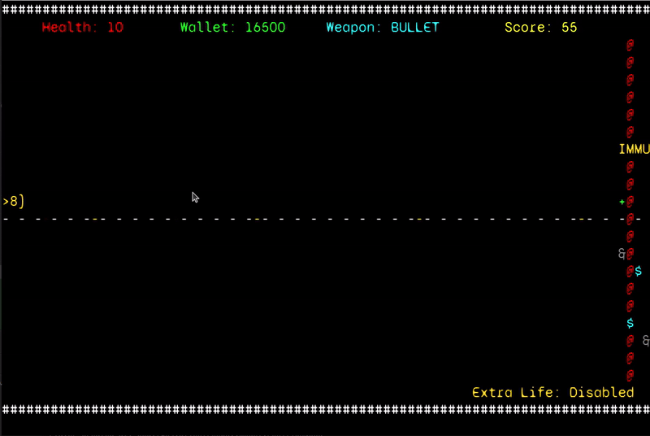
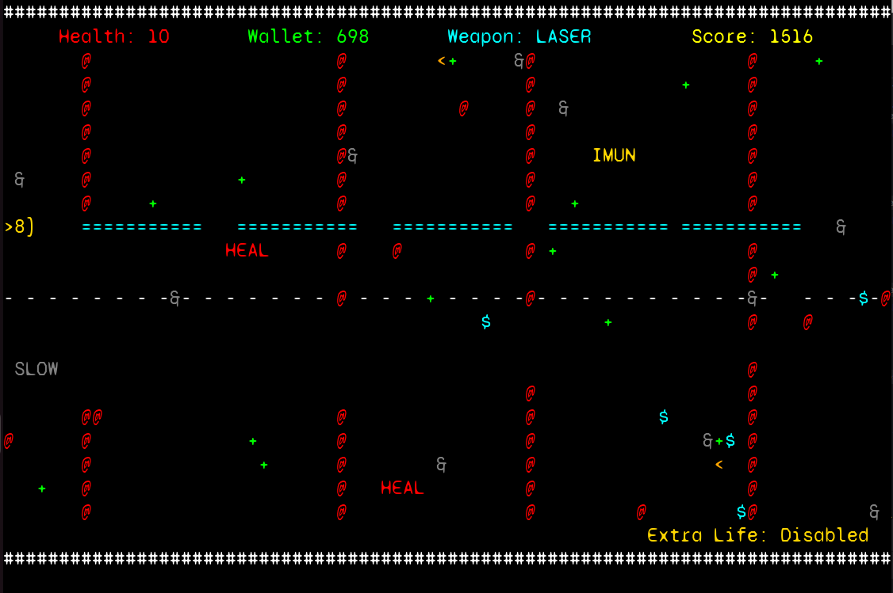
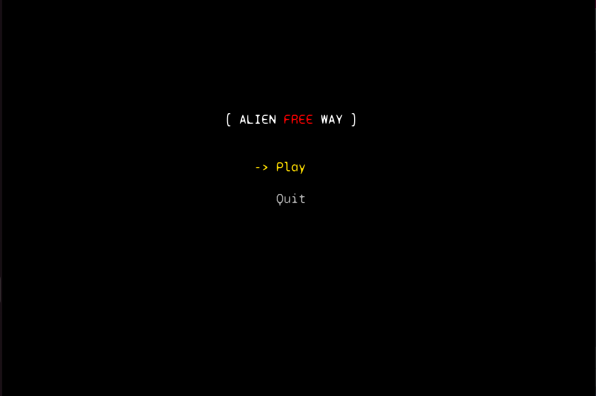
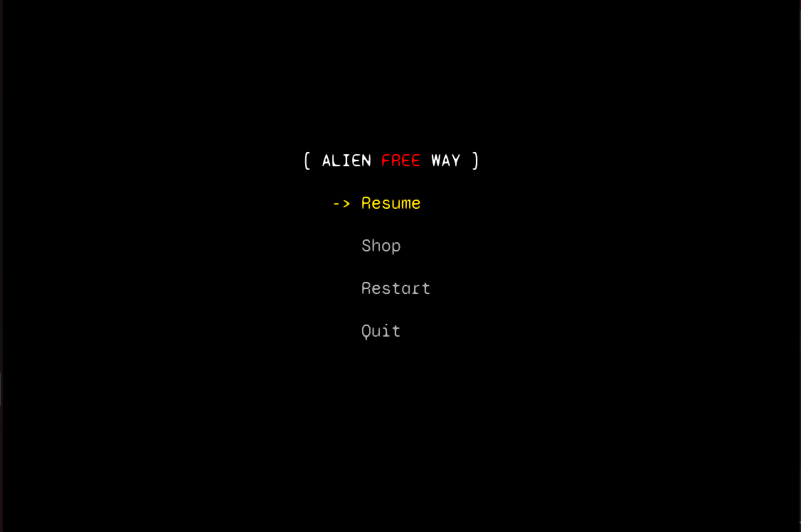
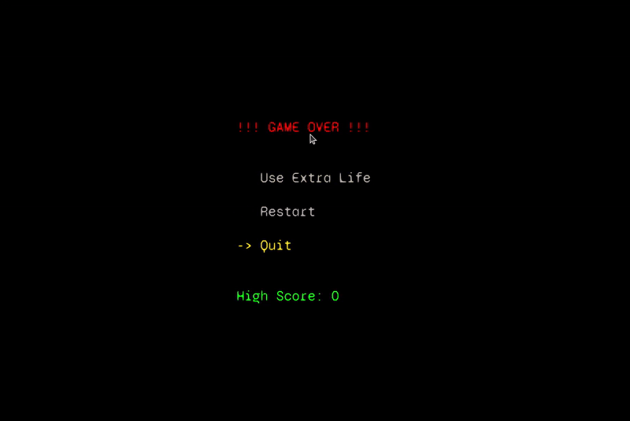
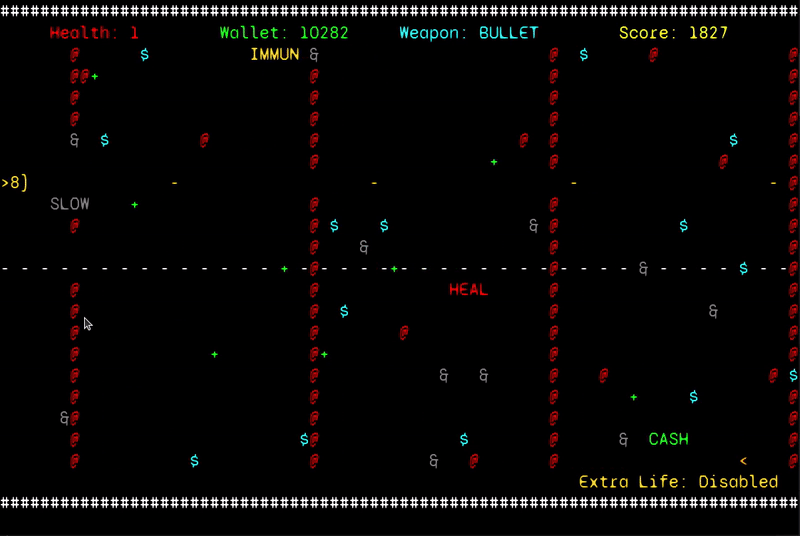

#Alien Free-Way

## Game Description

In a post-apocalyptic world, the player controls a powerful armed tank battling relentless hordes of alien enemies determined to halt their progress. The player navigates the tank vertically, dodging or engaging enemies in a test of skill and strategy. Starting with a basic weapon, 10 health points, and an empty wallet, the goal is to survive as long as possible while collecting rewards and making tactical decisions.

Defeating enemies earns coins, which can be used in a store to purchase upgraded shots or an extra life. Upgraded shots temporarily enhance the tank’s firepower for 10 seconds before reverting to the default shot. Since there is no shot inventory, players must carefully plan the timing of their purchases to maximize their effectiveness in combat.

The store also offers an extra life feature, allowing players to continue their journey without losing progress after death. This provides a crucial second chance to extend gameplay and push for higher scores.

Enemy collisions deal damage to the tank, making precise movement essential to avoid unnecessary damage. Occasionally, power-ups appear on the battlefield, granting temporary advantages and creating moments of opportunity amidst the chaos.

The game implements a shot system that allows the player to fire different types of projectiles based on their equipped shot type. Shots interact dynamically with the environment, damaging enemies on collision.

The game features a static background complemented by an immersive soundtrack that heightens the intensity of the experience. These elements combine to create a dynamic and engaging gameplay environment.

Inspired by _Space Impact_, this version introduces a deeper connection between the player and the gameplay, emphasizing precise movement, strategic purchases, and quick decisions to ensure survival on the road ahead.

This project was developed by *Afonso Pereira* (*up202305652*@fe.up.pt), *João Brás* (*up201001508*@fe.up.pt) and *Rodrigo Leite* (*up202205322*@fe.up.pt).

For a more detailed version of this description click [here](./docs/README.md).

## Screenshots and GIFs

The following screenshots illustrate the general look of our game, as well as the divergent functionalities:

### Game Preview

  
    

  

  
  <b><i>Fig 1. Gameplay of Alien Free Way</i></b>  

### Laser Shot

  
    

  

   
  <b><i>Fig 2. Gameplay of Alien Free Way with Laser Shot</i></b>    

#### Menus

 
    

  

 
  <b><i>Fig 3. Main Menu</i></b>  

   
    

  

 
  <b><i>Fig 4. Mid Game Menu</i></b>  

   
    

  

 
  <b><i>Fig 5. Shop Menu</i></b>  

   
    

  

   
  <b><i>Fig 6. Game Over Menu</i></b>  

   
  

  

   
  <b><i>Fig 7. Buying and using an Extra Life</i></b>  

## UML Schema

  
    

  

   
  <b><i>Fig 8. UML Schema</i></b>  

