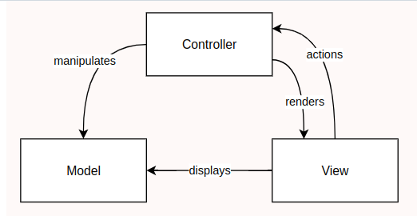
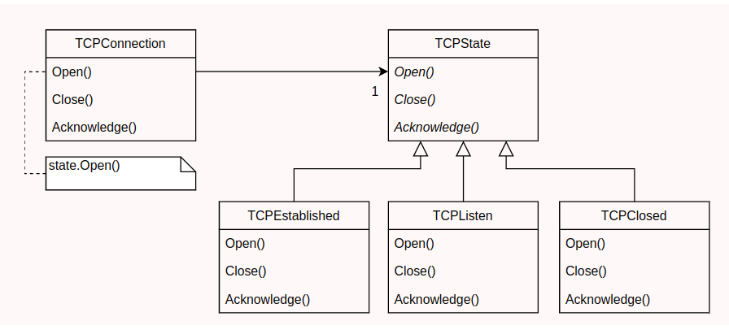
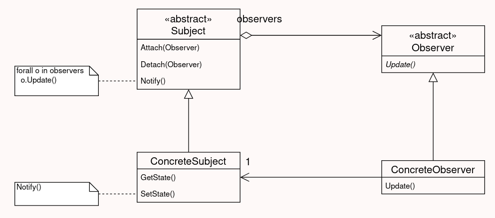
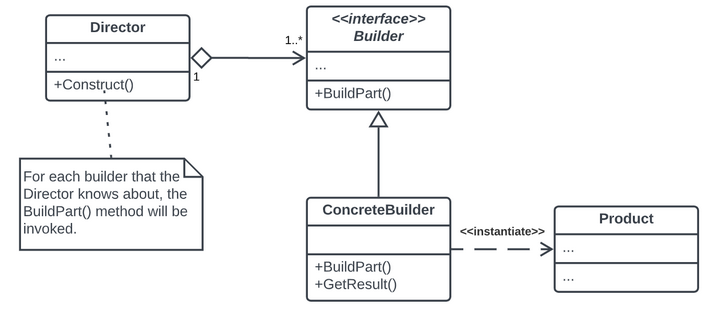
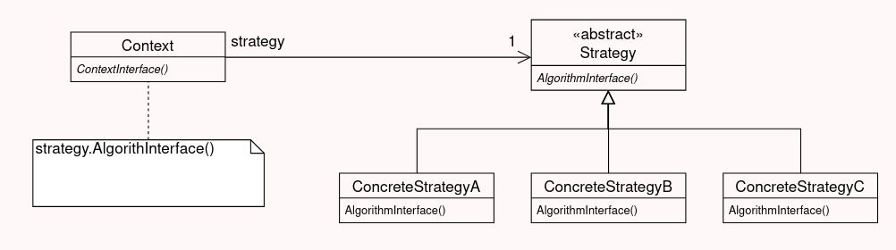
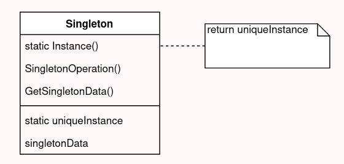
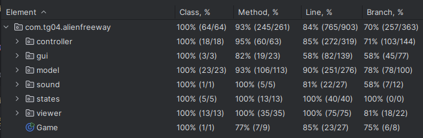

# Alien Free-Way

## Game Description

In a post-apocalyptic world, the player controls a powerful armed tank battling relentless hordes of alien enemies determined to halt their progress. The player navigates the tank vertically, dodging or engaging enemies in a test of skill and strategy. Starting with a basic weapon, 10 health points, and an empty wallet, the goal is to survive as long as possible while collecting rewards and making tactical decisions.

Defeating enemies earns coins, which can be used in a store to purchase upgraded shots or an extra life. Upgraded shots temporarily enhance the tank’s firepower for 10 seconds before reverting to the default shot. Since there is no shot inventory, players must carefully plan the timing of their purchases to maximize their effectiveness in combat.

The store also offers an extra life feature, allowing players to continue their journey without losing progress after death. This provides a crucial second chance to extend gameplay and push for higher scores.

Enemy collisions deal damage to the tank, making precise movement essential to avoid unnecessary damage. Occasionally, power-ups appear on the battlefield, granting temporary advantages and creating moments of opportunity amidst the chaos.

The game implements a shot system that allows the player to fire different types of projectiles based on their equipped shot type. Shots interact dynamically with the environment, damaging enemies on collision.

The game features a static background complemented by an immersive soundtrack that heightens the intensity of the experience. These elements combine to create a dynamic and engaging gameplay environment.

Inspired by _Space Impact_, this version introduces a deeper connection between the player and the gameplay, emphasizing precise movement, strategic purchases, and quick decisions to ensure survival on the road ahead.

This project was developed by *Afonso Pereira* (*up202305652*@fe.up.pt), *João Brás* (*up201001508*@fe.up.pt) and *Rodrigo Leite* (*up202205322*@fe.up.pt).

## Implemented features

- **Player Movement**: Control a tank armed with weapons using the arrow keys to move vertically.
- **Enemy Collisions**: Deal damage to the tank when it collides with enemies.
- **Reward System**: Earn coins for defeating enemies.
- **Shop System**: Purchase different types of shots or an extra life using coins.
- **Extra Life System**: Buy an extra life to continue the game without losing your progress.
- **Shot System**: Allows the player to fire projectiles to attack enemies. Each shot type has unique characteristics, such as speed and damage. Players must manage their equipped shot type strategically, as upgrades last for 10 seconds.
- **Different Shot Types**:
    - **Bullet**: Default shot, fast-moving with low damage.
    - **Missile**: A slow-moving shot that deals high damage.
    - **Laser**: A balanced shot with medium damage and speed.
    - **Power Shot**: Three powerful shots with high damage and speed.
- **Different Enemy Types**:
    - **Basic enemies**: Standard speed and low health with straightforward movement.
    - **Fast enemies**: Quick movement, does not deal damage to the player but rewards a high number of coins upon defeat.
    - **Armored enemies**: Equipped with a shield that must be destroyed before damaging the enemy itself.
    - **Healing enemies**: Regenerates health over time.
    - **Stealth enemies**: Becomes invisible temporarily, reappearing unpredictably.
    - **Zig-zag enemies**: Moves in a chaotic zig-zag pattern.
- **Power-Ups**:
    - **Shot**: Temporarily increases the player's shooting speed.
    - **Immun**: Grants temporary immunity from damage.
    - **Cash**: Temporarily doubles the coins earned by the player.
    - **Slow**: Permanently slows down already spawned enemies.
    - **Heal**: Restores a portion of the player's health.
- **Connected menus**:
    - **Main Menu**: Start or quit the game.
    - **Mid-Game Menu**: Pause, resume or restart the game, gives access to the shop.
    - **Shop Menu**: Access to purchase weapons or the extra life.
    - **Game Over Menu**: Restart or quit the game.
- **Sound Effects**: Includes immersive background music and various sound effects for projectiles and menu navigation.

## Design Patterns
### MVC (Model-View-Controller)
- **Classes Involved**:
    - **Model**: Classes in the model package, such as Player, Enemy, Road, and PowerUps. 
    - **View**: Classes in the viewer package, such as PlayerViewer, RoadViewer, and MenuViewer. 
    - **Controller**: Classes in the controller package, such as PlayerController, RoadController, and ShopMenuController. 

The MVC architecture is used to separate the game logic (Model), user interaction logic (Controller), and rendering logic (View).
For example, PlayerController manages the player's interactions, Player stores the player's state, and PlayerViewer handles how the player is displayed.

- **Advantages**:
    - **Separation of Concerns**: Each part of the game logic is modular and easier to manage or extend.
    - **Testability**: Controllers can be tested independently of the rendering logic.
    - **Flexibility**: Changes to the view (e.g., graphics library) don't affect the model or controller.

  
  

 
  <b><i>Fig 9. Model, View and Controller design pattern </i></b>

### State Pattern
- **Classes Involved**:
    - Classes in the states package, such as MainMenuState, GameState, MidGameMenuState, and ShopMenuState.

The game uses a State interface to represent various states (e.g., main menu, gameplay, shop menu).
The Game class manages the current state and transitions between states using the setState method.

- **Advantages**:
    - **Ease of Transition**: Simplifies the logic for switching between different states of the game.
    - **Scalability**: Adding new states (e.g., pause menu) only requires implementing a new class.
    - **Code Organization**: Each state has its logic encapsulated, reducing complexity.

 
  

 
  <b><i>Fig 10. State design pattern </i></b>

### Observer Pattern
- **Classes Involved**:
    - Not directly implemented as a library utility, but implied in event handling mechanisms like listening for ACTION inputs in LanternaGUI or managing player power-ups.
      Player class uses methods like activatePowerUp and updatePowerUpTimers to manage temporary power-up effects.

This pattern is implicitly used for managing inputs and reactions, such as key presses triggering corresponding actions in the game.

- **Advantages**:
    - **Decoupling**: Separates the input logic from the actions triggered.
    - **Extensibility**: New interactions can be added without modifying the existing structure.

  

 
  <b><i>Fig 11. Observer design pattern </i></b>

### Builder Pattern
- **Classes Involved**:
    - RoadBuilder.

The RoadBuilder class encapsulates the construction logic for creating the Road object, including walls, enemies, and power-ups.
This pattern abstracts the complexity of assembling a complete Road.

- **Advantages**:
    - **Modularity**: Simplifies the creation of complex objects by breaking down the construction process.
    - **Readability**: The construction process is more readable and maintainable.

  

  <b><i>Fig 12. Builder design pattern </i></b>

### Strategy Pattern
- **Classes Involved**:
    - Enemy subclasses (e.g., ArmoredEnemy, StealthEnemy, ZigZagEnemy).

Different enemy types implement unique behavior (e.g., movement patterns, health properties) while inheriting from a common Enemy class.

- **Advantages**:
    - **Behavior Flexibility**: Allows easily swapping or adding new enemy behaviors.
    - **Code Reuse**: Shared logic resides in the Enemy superclass.

 
  

 
  <b><i>Fig 13. Strategy design pattern </i></b>

### Singleton Pattern
- **Classes Involved**:
    - SoundPlayer (if configured as a single utility for sound management).

SoundPlayer handles background music and sound effects, and it can be treated as a singleton to ensure a single point of audio control.

- **Advantages**:
    - **Resource Efficiency**: Ensures that only one instance of the sound manager exists.
    - **Global Access**: Centralizes sound control for easy management.

  

  <b><i>Fig 14. Singleton design pattern </i></b>

## Known-code smells

We have fixed all the errors reported by error-prone. No other major code smells identified. 
[Error-prone Report](./errorprone/errorprone-report.txt)

## Testing

### Screenshot of coverage report

  

  <b><i>Fig 15. Code coverage screenshot</i></b>

### Link and screenshot of mutation testing report

[Mutation tests](../build/reports/pitest/index.html)

  

  <b><i>Fig 16. Pit Test Coverage Report screenshot</i></b>

## Self-evaluation

The work was divided in a mutual way and we all contributed with our best. It helped us to enrich our java and principle/pattern knwoledge, as well as our team work.

- Afonso Pereira: 33.3%
- João Brás: 33.3%
- Rodrigo Leite: 33.3%

